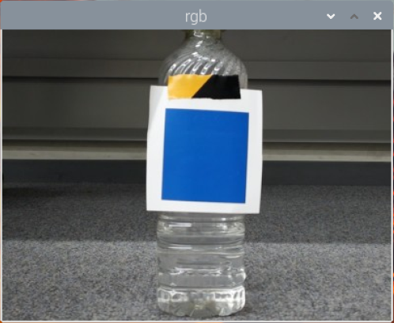
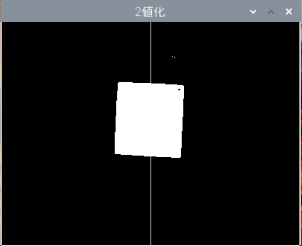

# EmbeddedTechnologySoftwareDesignRobotContest

自律走行ロボット（RasPike等）を制御し、コース上のラインを高速かつ安定して走行させるための制御ソフトウェアです。
従来の光センサーによるライントレースに加え、カメラを用いた画像認識による高度な走行制御を実装しています。

## 実装システム概要

本プロジェクトは、リアルタイムOS環境下で動作する制御ロジックと、画像解析によるナビゲーションの2軸で構成されています。

### 1. PID制御によるライントレース (`LineTrace.c`)
目標輝度と現在のセンサー値の差分に対し、**P（比例）、I（積分）、D（微分）制御**を適用しています。
- **P制御**: 現在のズレに応じた修正。
- **I制御**: 蓄積された微小なズレ（定常偏差）を解消。
- **D制御**: 急激な変化（カーブの入り口など）を検知し、オーバーシュートを抑制。
これにより、滑らかで高速なライントレースを実現しています。

### 2. OpenCVを用いた色検出とトラッキング (`color_detect.py`, `color_tracking.c`)
Raspberry Pi Cameraを使用し、特定の色のラインやオブジェクトを認識して走行を補正します。
- **HSV空間での抽出**: RGBではなく、照明の変化に強いHSV色空間を用いて「青色」を安定して抽出。
- **二値化・面積計算**: 画像を二値化し、左右のピクセル量の差からステアリング量を計算。
- **Python-C連携**: Pythonで解析した結果をテキストファイルを介してC言語側のメインロジックへフィードバックし、モータ出力を決定しています。
二値化前
 
二値化後

## 使用技術
- **言語**: C (制御ロジック), Python 3 (画像処理)
- **ライブラリ**: OpenCV (画像認識), PiCamera2

## ファイル構成
| ファイル名 | 役割 |
| :--- | :--- |
| `LineTrace.c` | メインのライントレース処理（PID制御実装） |
| `color_detect.py` | カメラ画像から青色を抽出し、左右の重心差を計算するスクリプト |
| `color_tracking.c` | Pythonの解析結果を読み込み、モータパワーを決定する制御モジュール |

---
### 制作
- **作成時期**: 2024年
- **プロジェクト**: ETロボコン（Embedded Technology Software Design Robot Contest）