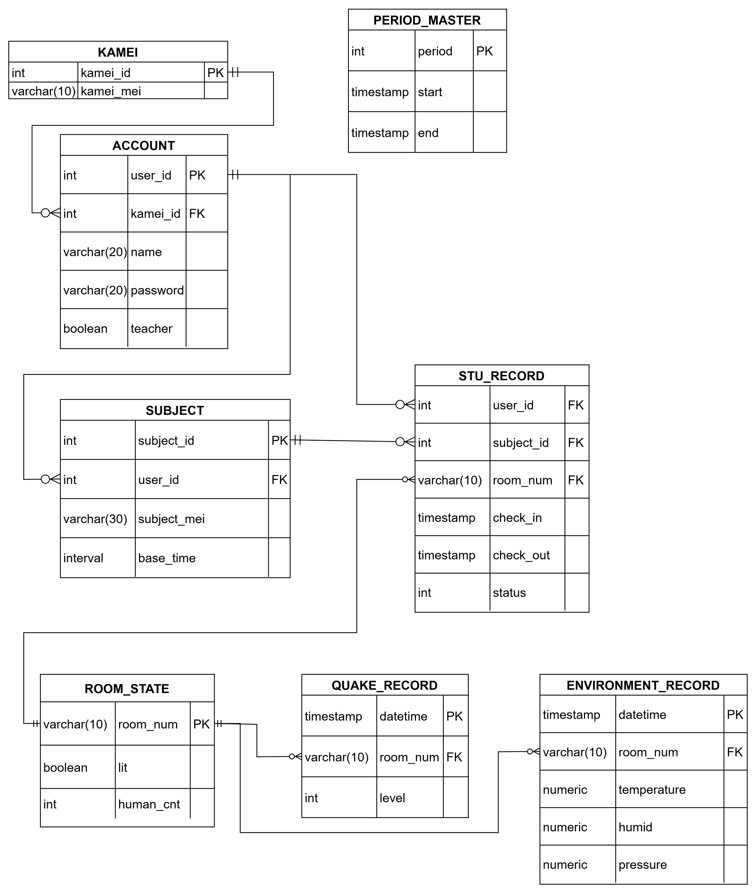
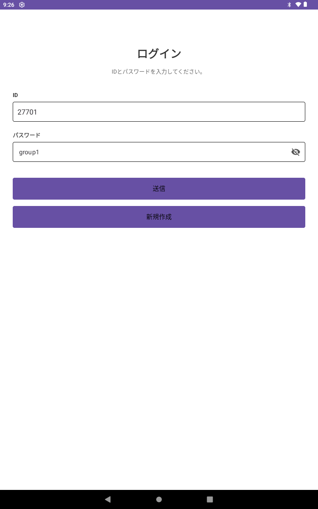
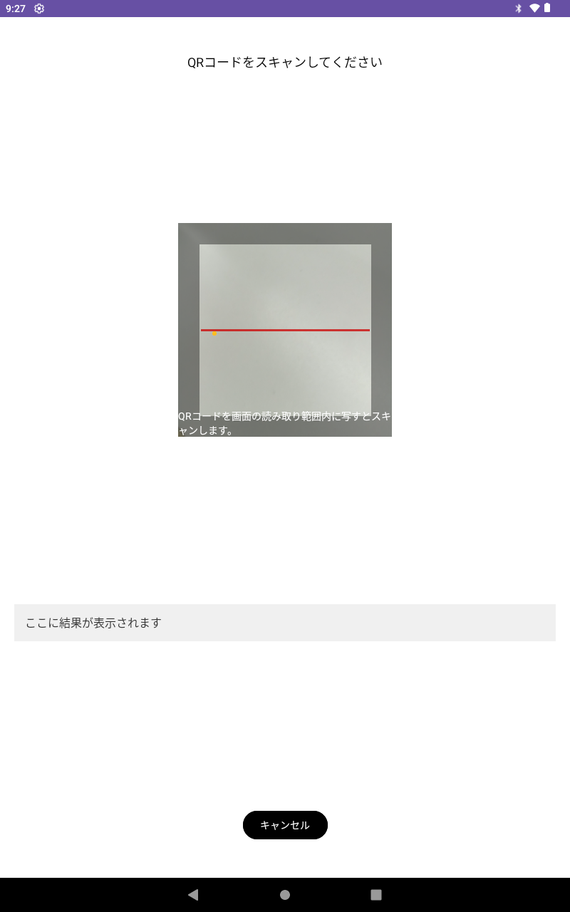
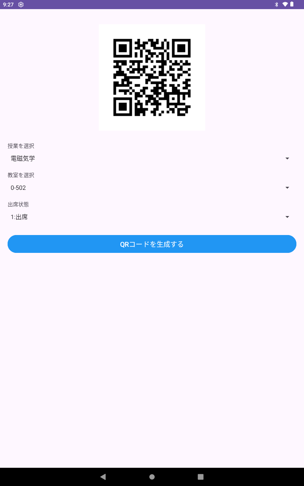

# Smart Attendance Management System

ハードウェア（Arduino/センサー）からバックエンド（PHP/DB）、モバイルアプリ（Android）までを統合した、リアルタイム出席管理システムです。
QRコードにより出席状況をデータベースへ記録し、デスクトップpcからリアルタイムに確認できます。

## システム構成図
本システムは以下の4つのコンポーネントが連携して動作します。

1. **デバイス層 (Arduino)**: 
   QRコードを用いて個人の識別IDを取得し、Wi-Fi/Ethernet経由でサーバへHTTPリクエストを送信します。
2. **サーバ層 (Apache/PHP)**: 
   デバイスからのデータを受け取り、登録時刻の検証や重複打刻チェックなどのビジネスロジックを処理します。
3. **データ層 (PostgreSQL)**: 
   学生情報、講義スケジュール、および出席ログを厳密に管理します。
4. **アプリケーション層 (Android/Java)**: 
   教員や学生が現在の出席状況をグラフやリスト形式でリアルタイムに閲覧できます。

## 使用技術
- **使用技術**: PHP, javascript, java, Android Studio, Arduino IDE, Apache, Postgresql, Chrony, Debian13

## フォルダ構成
```text
SmartAttendanceManagementSystem/
├── android/      # Android Studio プロジェクト（Java,xml）
├── arduino/      # Arduino スケッチ（センサー制御・通信プログラム）
├── server/       # バックエンド（PHPスクリプト、Apache設定ファイル）
└── database/     # DB設計（SQL、テーブル定義書）
```text

## テーブル設計


## 動作
デスクトップpcのホーム画面

デスクトップpcの詳細画面

タブレットのログイン画面

タブレットの生徒用

タブレットの先生用




