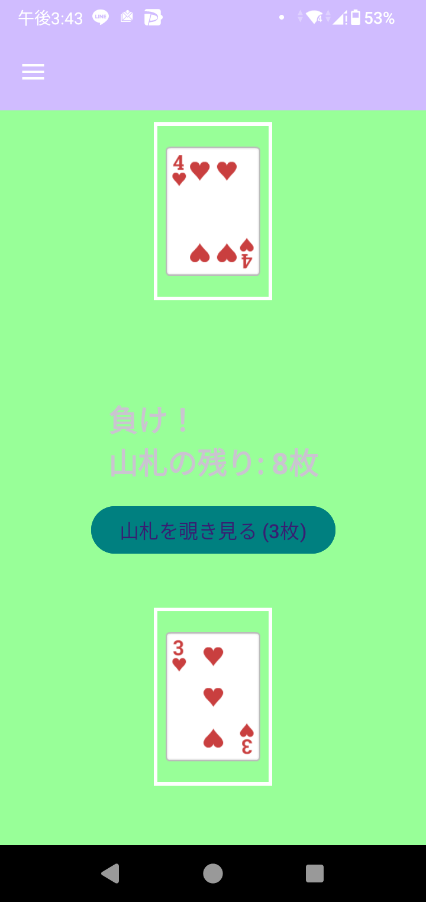
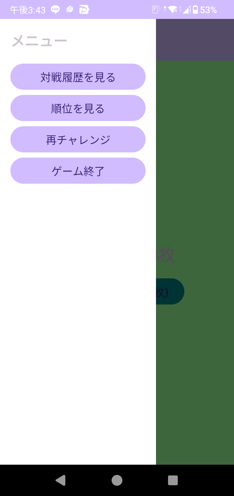

# cardgame

Android Studioで開発した、対話型のトランプカードゲームアプリです。
オブジェクト指向プログラミングに基づいたゲームロジックの実装と、Android独自のライフサイクルやUIコンポーネントの活用を目的として制作しました。

## ゲーム概要
CPUを相手にカードの強さを競うゲームです。通常の対戦に加え、戦略性を高めるための特殊機能を搭載しています。

### 主な機能
- **対戦ロジック**: カードの数値とマークに基づいた勝敗判定。
- **のぞき見機能 (Cheat)**: 山札の残り枚数に応じて、次のカードを一時的に確認できる戦略的要素。
- **対戦履歴 (HistoryActivity)**: `GridLayout` を活用し、自分とCPUが過去に出したカードを視覚的に一覧表示。
- **ランキング機能 (ScoreActivity)**: `SharedPreferences` を用いてユーザーごとの勝敗数を保存。勝率順に並べ替えて表示するランキングシステム。
- **ナビゲーションドロワー**: `DrawerLayout` を採用し、直感的なメニュー操作を実現。

## 使用技術
- **Language**: Java
- **Framework**: Android SDK (Android Studio)
- **UI Design**: XML (ConstraintLayout, DrawerLayout, ScrollView)

## 主要ファイル構成
| ファイル名 | 役割 |
| :--- | :--- |
| `MainActivity.java` | ゲームのメインロジック、デッキ管理、のぞき見機能の実装。 |
| `HistoryActivity.java` | Intentで受け取った対戦履歴を動的にImageViewとして生成・表示。 |
| `ScoreActivity.java` | データの保存・読み込み、ランキングのソートアルゴリズムの実装。 |
| `activity_main.xml` | 背景画像やツールバーを含む、メイン画面のレイアウト定義。 |
| `activity_history.xml` | 履歴表示用のスクロール可能なレイアウト定義。 |
| `activity_score.xml` | スコア表示用のスクロール可能なレイアウト定義。 |

## 動作

---
### 制作
- **開発環境**: Android Studio
- **作成時期**: 2025年