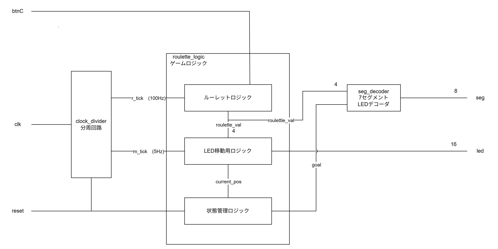

# sugorokugame

FPGAボード「Basys3」上で動作する、Verilog HDLで記述されたルーレット形式のすごろくゲームです。
単なる数値の切り替えだけでなく、物理的なルーレットの挙動を模した「減速演出」や「ゴール判定」などのロジックを自作しました。

## プロジェクト概要
ルーレットボタンをルーレットの開始・停止のトリガーとし、停止した出目（1〜6）の数だけ、ボード上の16個のLEDが進みます。最終的に15番目のLEDにぴったり止まれば「ゴール」となります。

## システム構成
このプロジェクトは以下のモジュールで構成されています。

| ファイル名 | 役割 |
| :--- | :--- |
| `sugoroku_top.v` | 各モジュールを接続するトップレベルモジュール |
| `roulette_logic.v` | ルーレットの回転、減速停止、LED移動、ゴール判定のメインロジック |
| `clock_divider.v` | メインクロック(100MHz)から制御用クロックを生成 |
| `seg_decoder.v` | 7セグメントLED用のデコーダー（1〜6、および 'C' の表示） |
| `digit_selector.v` | 7セグメントディスプレイの表示桁（アノード信号）の制御 |
| `Basys3_Master.xdc` | Basys3のピン配置および電圧規格（LVCMOS33）の定義ファイル |

## 操作方法
1. **スタート/ストップ**:ルーレットボタンを押している間、数値が高速回転します。ボタンを離すと減速して停止します。
2. **移動**: 確定した数字の分だけ、LEDの点灯位置が右へ移動します。
3. **ゴール**: 最後のLED（15番目）にちょうど止まるとゴールとなり、7セグに 'C' が表示されます。
4. **リセット**: `reset` ボタン (T18ピン) を押すと、1つ目のLEDが点灯する初期状態に戻ります。

